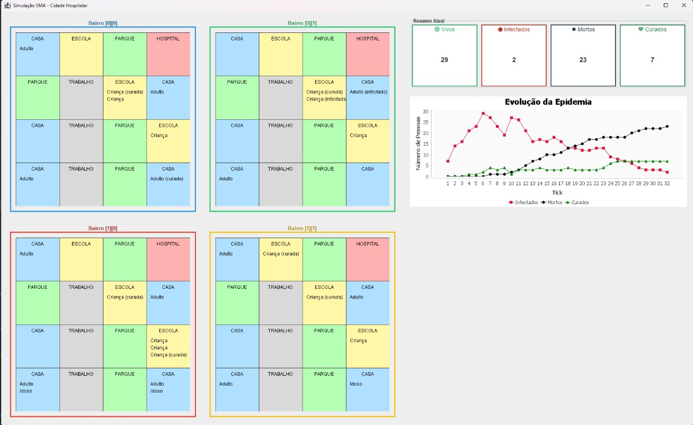
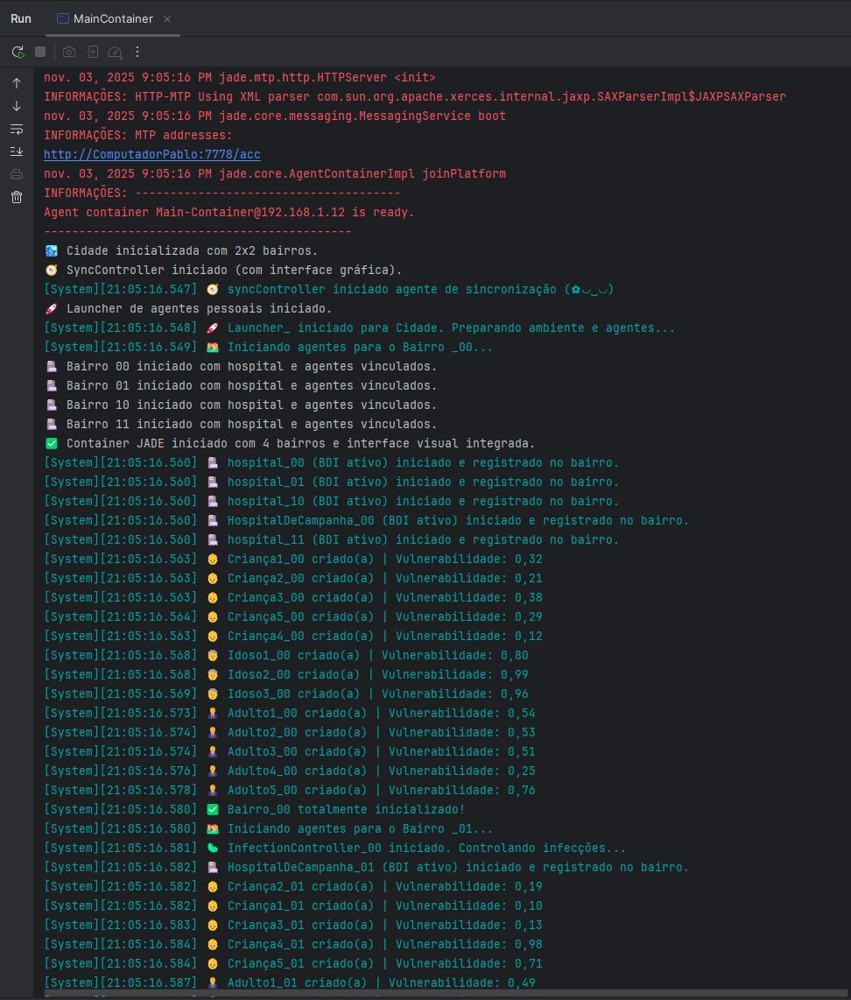

# SMA & Swarm no Domínio Hospitalar

**Disciplina**: FGA0053 - Sistemas Multiagentes  
**Nro do Grupo (de acordo com a Planilha de Divisão dos Grupos)**: G2 
**Frente de Pesquisa**: SMA & Swarm & Behaviour & BDI 

## Alunos
| Matrícula  | Aluno                                   |
|------------|-----------------------------------------|
| 19/0085045 | Brenno da Silva Oliveira                |
| 19/0115564 | Pedro Lucas Siqueira Fernandes          |
| 20/0025791 | Pablo Guilherme de Jesus Batista Silva  |
| 19/0020407 | Thiago Vivan Bastos                     |
| 18/0014412 | Cainã Valença de Freitas                |
| 15/018312  | Guilherme Lima Matos Leal               |

## Sobre 
Trata-se de uma aplicação baseada em sistemas multiagentes voltada à simulação de cidades artificiais, com o objetivo de analisar e compreender como hospitais podem compartilhar recursos para otimizar o fluxo e a vazão de pacientes em períodos de alta demanda, como durante a pandemia de COVID-19.

Os agentes hospitalares foram desenvolvidos seguindo o modelo BDI (Belief-Desire-Intention), permitindo decisões autônomas e adaptativas, enquanto os agentes pacientes utilizam o TickerBehaviour para representar suas ações e interações no decorrer do dia a dia da simulação.

## Screenshots

## Instalação  
**Linguagem:** Java  
**Tecnologia:** JADE  

Para executar o projeto, é necessário ter o **Java** devidamente configurado no ambiente e adicionar o **JAR do JADE** e os **frameworks de interface gráfica** como bibliotecas do projeto, para permitir a execução correta da tela da simulação.  

**JARs Externos:**  
[Pasta de JARs](https://github.com/UnBSMA2025-2/2025.2_G2_SMA_SwarmDominioHospitalar/tree/develop/jarsExternos)  

Exemplo dos JARs sendo usados:

Recomenda-se o uso do **IntelliJ IDEA**, pois ele oferece uma configuração mais simples e rápida tanto para o Java quanto para o JADE, facilitando o processo de **execução** e **depuração** da aplicação.  

## Uso  
Para utilizar a aplicação, é necessário acessar a branch **`develop`**, onde está localizada a versão funcional do projeto.  
Após isso, execute o arquivo **`MainContainer`** para iniciar a simulação e acompanhar sua execução.  

Também é possível rodar o script **`run.sh`** para automatizar o processo de inicialização do sistema:  
[run.sh](https://github.com/UnBSMA2025-2/2025.2_G2_SMA_SwarmDominioHospitalar/blob/develop/run.sh)

## Vídeo
Adicione 1 ou mais vídeos com a execução do projeto.
Procure: 
(i) Introduzir o projeto;
(ii) Mostrar passo a passo o código, explicando-o, e deixando claro o que é de terceiros, e o que é contribuição real da equipe;
(iii) Apresentar particularidades do Paradigma, da Linguagem, e das Tecnologias, e
(iV) Apresentar lições aprendidas, contribuições, pendências, e ideias para trabalhos futuros.
OBS: TODOS DEVEM PARTICIPAR, CONFERINDO PONTOS DE VISTA.
TEMPO: +/- 15min

## Participações

|Nome do Membro | Contribuição | Significância da Contribuição para o Projeto (Excelente/Boa/Regular/Ruim/Nula) | Comprobatórios (ex. links para commits)|
| -- | -- | -- | -- |
| Pedro Lucas e Pablo Guilherme  |  Criação dos agentes (Criança, Adulto e Idoso) | Boa | [Adicionando esqueleto dos agentes Adulto e Idoso](https://github.com/UnBSMA2025-2/2025.2_G2_SMA_SwarmDominioHospitalar/commit/49e84a40c6908eb52a585b4063017258515b01da) |
| Pedro Lucas  |  Adiciona Classe Bairro e Doença | Boa | [added covid and infeccion](https://github.com/UnBSMA2025-2/2025.2_G2_SMA_SwarmDominioHospitalar/commit/99e7d0863b4888c5eaf63d9e0f487ae66eec75e9)  |
| Pedro Lucas  |  Adiciona contágio e movimentação inicial na criança e no adulto | Boa | [added Adult](https://github.com/UnBSMA2025-2/2025.2_G2_SMA_SwarmDominioHospitalar/commit/3672a812f39dd93c778dc692372146ac423377e4#diff-5cc7e104d0563a65d0bf5695d66f8f8600de51b67b01ecab1b18c3248ecb8667)  e [added Elder contagious](https://github.com/UnBSMA2025-2/2025.2_G2_SMA_SwarmDominioHospitalar/commit/e7e57217a2aef6816ecba4efc985f4dfedf49517)  |
| Pedro Lucas  |  Refatora agentes para ter um agente abstrato para classes com métodos semelhantes | Boa | [cria agente abstrato](https://github.com/UnBSMA2025-2/2025.2_G2_SMA_SwarmDominioHospitalar/commit/d2eba96e98f62b243baeb8494e79b89fbbec10a1) |
| Pedro Lucas  |  Refatora máquina de ticks/estados para ter classe abstrata com métodos e funções semelhantes | Boa | [cria fsm abstrato](https://github.com/UnBSMA2025-2/2025.2_G2_SMA_SwarmDominioHospitalar/commit/9203929d56f2416d0e1ade69187740e9ccca9592) |
| Pedro Lucas  |  Refatora o hospital para ser um agente BDI | Boa | [hospital criado](https://github.com/UnBSMA2025-2/2025.2_G2_SMA_SwarmDominioHospitalar/commit/33b82c6a8170407538f4e578612854ddc5ca4355) |
|Pablo Guilherme e Thiago Vivan|Adicionando agente syncController para coordenação dos agentes| Boa |[Corrige erro de sincronização](https://github.com/UnBSMA2025-2/2025.2_G2_SMA_SwarmDominioHospitalar/commit/dd5a16a45fe1e20ca1ad149e94068ba24befec1c)|
|Pablo Guilherme e Pedro Lucas|Criação do primeiro agente hospital para testes| Boa |[Implementa HospitalDeCampanha como behavior](https://github.com/UnBSMA2025-2/2025.2_G2_SMA_SwarmDominioHospitalar/commit/1e73db6783b54974f602d51835703e92a7a49224)|
|Pablo Guilherme |Correção para remoção de agentes mortos na simulação| Boa |[Adicionando a remoção de agentes mortos pela doença ಥ_ಥ](https://github.com/UnBSMA2025-2/2025.2_G2_SMA_SwarmDominioHospitalar/commit/d2247eb0ddd6b0e78998634d6b98ff17f94e2656)|
|Pablo Guilherme e Thiago Vivan|Criação de um log padronizado para todo o projeto para melhora de debug| Boa |[Adicionando classe de Log para padronização e melhorando as informações da simulação](https://github.com/UnBSMA2025-2/2025.2_G2_SMA_SwarmDominioHospitalar/commit/45f3c233ea98a61703405b1b873b4f1eaa0a1eb5)|
|Pablo Guilherme|Criação de uma interface gráfica para facilitar a visualização da simulação| Boa |[Adicionando interface grafica e libs necessarias 😎](https://github.com/UnBSMA2025-2/2025.2_G2_SMA_SwarmDominioHospitalar/commit/ca39f5fe56e4c44a88b6dfaf8826d5ea3fc86d3c)|
|Thiago Vivan|Criação da lógica inicial de progressão de doença e mudança de comportamentos de acordo com a gravidade de sintomas| Boa |[Lógica inicial de progressão](https://github.com/UnBSMA2025-2/2025.2_G2_SMA_SwarmDominioHospitalar/commit/e735163984497fc39cb9d77b249eb460036c59ad)|
|Thiago Vivan|Criação da cidade e refatoração de código para se adequar a vários bairros e agentes distintos| Boa |[Criação da Cidade](https://github.com/UnBSMA2025-2/2025.2_G2_SMA_SwarmDominioHospitalar/commit/50cf05d8be5d5aed9c9f5de665ace79339661788)|
|Thiago Vivan|Ajustes finais para correção na comunicação entre agentes e hospitais| Boa |[Ajustes de comunicação](https://github.com/UnBSMA2025-2/2025.2_G2_SMA_SwarmDominioHospitalar/commit/8b3ae1280029fafd7b0fea6e3839b1d1d3e729c7)|
| Cainã Freitas | Reestruturação do repositório e adição de script de execução | Boa | [add jade.jar pra rodar no futuro](https://github.com/UnBSMA2025-2/2025.2_G2_SMA_SwarmDominioHospitalar/commit/df3b0c9e340baf3a7fb8b18a14cb8926f7a2f450), [add script](https://github.com/UnBSMA2025-2/2025.2_G2_SMA_SwarmDominioHospitalar/commit/45597abc379c5b1c2ec0bb03ac3acd01a477fd4c) |
| Cainã Freitas | Merge da funcionalidade de hospital | Boa | [Merge pull request #1 from UnBSMA2025-2/feat/hospital](https://github.com/UnBSMA2025-2/2025.2_G2_SMA_SwarmDominioHospitalar/commit/dc946190c694c0bb98c8bd344f88180f5ddb9dc7) |
| Cainã Freitas | Adição de hospital e bairro 4x4 | Boa | [add hospital e bairro 4x4](https://github.com/UnBSMA2025-2/2025.2_G2_SMA_SwarmDominioHospitalar/commit/9a9567d3df39f7fd8f7dfe5bf1f34a87968824d7) |
| Cainã Freitas | Remoção de pasta de IDE e Limpeza do repo | Boa | [remove pasta de IDE](https://github.com/UnBSMA2025-2/2025.2_G2_SMA_SwarmDominioHospitalar/commit/081abb21b2265f0824e5b7d471fa68126f5dd6e4) |

## Lições aprendidas  

### Pedro Lucas

1. Aprendi um novo paradigma de programação, compreendendo como os agentes de software podem ser aplicados para resolver uma ampla variedade de problemas. No entanto, percebi que o uso desse modelo exige tempo, paciência e uma curva de aprendizado significativa para entender seus conceitos e aplicá-los de forma eficiente.

2. Trabalho Futuro: Acredito que a proposta possa ser expandida para uma implementação mais próxima do mundo real, incorporando um maior número de variáveis e condições. Dessa forma, seria possível obter resultados mais precisos e representativos, aprimorando a simulação e sua aplicabilidade prática.

### Pablo Guilherme

1. Durante o desenvolvimento deste projeto, explorei uma nova e fascinante área da programação. Aprendi diversos conceitos inéditos e enfrentei vários desafios que exigiram bastante raciocínio e paciência. Foi possível perceber que, embora se trate de um tema complexo, é também extremamente envolvente e recompensador de estudar.

2. Para trabalhos futuros, acredito que aprimorar a comunicação entre os agentes, por exemplo, introduzindo comportamentos como o medo de se infectar durante a simulação, poderia enriquecer o modelo e torná-lo mais próximo da realidade, resultando em simulações mais dinâmicas e realistas.

### Thiago Vivan Bastos

1. Aprendi novos conceitos relacionados ao paradigma de multi agentes que não havia trabalhado na disciplina de paradigmas, bem como a utilização da plataforma JADE e tive um pouco mais de contato com o java, já que não tinha muita noção da linguagem.

2. Para trabalhos futuros, acredito que poderiam ser feitas melhorias no comportamentos dos agentes que representam pessoas, adicionando mais comportamentos, aleatoriadades e responsividade de acordo com a doença, bem como, seria interessante adicionar doenças novas com sintomas e características diferentes. 

### Cainã Freitas

1. Durante o desenvolvimento deste projeto, tive a oportunidade de me aprofundar na programação orientada a agentes e no framework JADE, o que me permitiu compreender na prática como sistemas multiagentes podem ser aplicados para modelar problemas complexos do mundo real. A experiência com a coordenação entre agentes, gestão do ciclo de vida e implementação de comportamentos autônomos foi particularmente valiosa para meu crescimento como desenvolvedor.

2. Trabalho Futuro: Vejo potencial para expandir esta simulação incorporando mais variáveis epidemiológicas e fatores sociais que influenciam a propagação de doenças. Além disso, a implementação de mecanismos de aprendizado de máquina poderia tornar os agentes mais adaptativos, criando uma simulação ainda mais realista e predictive para auxiliar em estudos de saúde pública.

## GithubPages:

For full documentation visit [mkdocs.org](https://www.mkdocs.org).

-  Commands

* `mkdocs new [dir-name]` - Create a new project.
* `mkdocs serve` - Start the live-reloading docs server.
* `mkdocs build` - Build the documentation site.
* `mkdocs -h` - Print help message and exit.

### Project layout

    mkdocs.yml    # The configuration file.
    docs/
        index.md  # The documentation homepage.
        ...       # Other markdown pages, images and other files.

### Tema

[Cinder](https://github.com/chrissimpkins/cinder)
