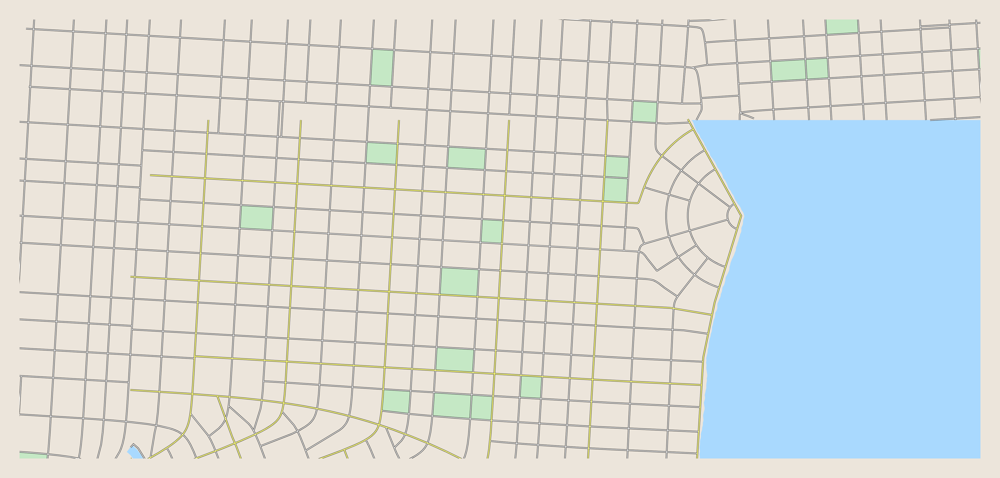
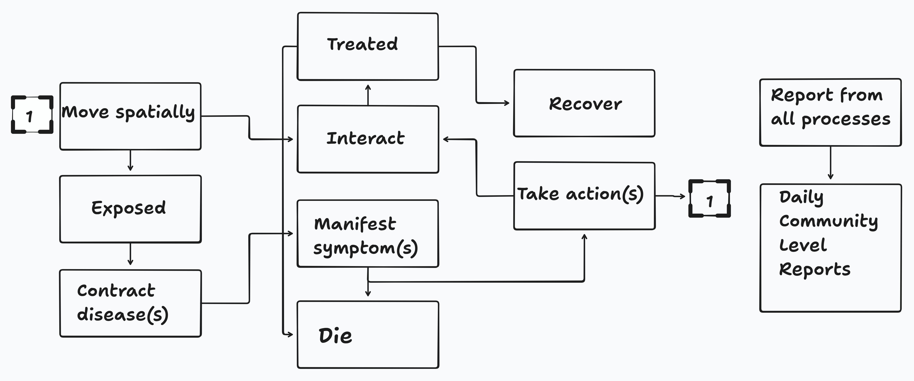

# Estruturação do Problema

## 1. Ambiente

Para representar o espaço onde os indivíduos transitam e interagem, será utilizado um **mapa quadriculado**, em que cada célula representa uma **casa** ou um **local de interesse**.  

Os locais de interesse são:  

- Escola (E)  
- Trabalho (T)  
- Supermercado (S)  
- Parque (P)  
- Festa (F)  

Cada agente possui uma **casa base (H)** de onde parte e para onde retorna no fim do dia.

Exemplo de representação:

Imagem real da cidade:  
{ width=100% }

Representação em quadrados:  
{ width=100% }

---

## 2. Agentes

Os agentes serão modelados como **autômatos probabilísticos**, cada um com os seguintes atributos:

- **Idade** (influencia rotina e suscetibilidade)  
- **Papel social** (estudante, trabalhador, desempregado, etc.)  
- **Estado de saúde**:  

  - Suscetível (S)  
  - Infectado (I)  
  - Recuperado (R)  

Fluxo dos agentes:

### Ciclo de Vida

- O tempo é dividido em **ticks** (ex.: 3 a 4 por dia), que representam **passos discretos de tempo**.  
- Em cada tick, o agente decide uma ação, que pode ser **controlada** (rotina) ou **esporádica** (aleatória).  

#### Ações Controladas

- Escola / Trabalho → ocorrem em 1 ou 2 ticks fixos do dia.  
- Supermercado → ocorre de forma esporádica.  
- Festa → ocorre em horários sociais (noites e finais de semana).  

#### Ações em Caso de Doença

Se infectado, o comportamento pode mudar:  

- Faltar ao trabalho/escola.  
- Permanecer em casa (repouso).  
- Buscar atendimento médico (dependendo da gravidade dos sintomas).  

---

## 3. Fórmulas de Motivação para Ações

A **probabilidade de um agente realizar uma ação \(a\) em um tick \(t\)** é dada por:

\[
P_a(t) = B_a \cdot A(t) \cdot M_i
\]

**Explicação:**  
- \(B_a\) → Base de motivação da ação: define a tendência natural do agente de realizar determinada ação.  
- \(A(t)\) → Ajuste temporal: considera hora do dia, dia da semana e fins de semana.  
- \(M_i\) → Fator individual: idade, papel social e sintomas de doença.

**Exemplo:**  
- Crianças → \(P_{escola}(t)\) alto em dias úteis pela manhã.  
- Adultos trabalhadores → \(P_{trabalho}(t)\) alto em dias úteis, baixo em fins de semana.  
- Todos → \(P_{supermercado}(t)\) moderado e aleatório.  
- Jovens → \(P_{festa}(t)\) alto em fins de semana.  

---

## 4. Fórmulas de Contaminação e Progressão do Estado de Saúde (Tempo Discreto)

### 4.1 Contaminação

A transmissão ocorre quando um agente **suscetível (S)** e um agente **infectado (I)** compartilham a mesma célula durante um tick:

\[
P_{trans}(i,j) = \beta \cdot C_{loc} \cdot S_i \cdot I_j
\]

**Explicação:**  
- \(\beta\) → taxa básica de transmissão da doença.  
- \(C_{loc}\) → fator de contágio do local.  
- \(S_i\) → suscetibilidade do agente \(i\).  
- \(I_j\) → infectividade do agente \(j\).

**Probabilidade composta para múltiplos infectados:**

\[
P_{infec}(i) = 1 - \prod_{j \in I_{celula}} \left( 1 - P_{trans}(i,j) \right)
\]

**Explicação:**  
- Cada infectado \(j\) na célula oferece uma chance **independente** de infectar \(i\).  
- \((1 - P_{trans}(i,j))\) → probabilidade de **não ser infectado por \(j\)** neste tick.  
- O produto calcula a probabilidade de **não ser infectado por nenhum**.  
- Subtraindo de 1, obtemos a chance de ser infectado por **pelo menos um** infectado nesse tick.

**Exemplo:**  
- Dois infectados na célula: \(P_{trans}(i,j_1)=0.1\), \(P_{trans}(i,j_2)=0.2\)  
- Probabilidade de não ser infectado: \(0.9 \cdot 0.8 = 0.72\)  
- Probabilidade de ser infectado: \(1-0.72 = 0.28\) (28% neste tick)

---

### 4.2 Progressão do Estado de Saúde

Cada tick, o agente infectado \(I\) pode **recuperar, morrer ou permanecer infectado**.

1. **Suscetível → Infectado**  

\[
S \xrightarrow{P_{infec}(i)} I
\]

- Probabilidade avaliada **em cada tick**, considerando todos os infectados na mesma célula.

2. **Infectado → Recuperado**  

\[
I \xrightarrow{P_{rec}} R
\]

- \(P_{rec}\) → probabilidade **por tick** de recuperação, já ajustada para o modelo discreto.

3. **Infectado → Morto**  

\[
I \xrightarrow{P_{mort}} D
\]

- \(P_{mort}\) → probabilidade **por tick** de morte, ajustada por fatores individuais.

---

### 4.3 Normalização das Probabilidades

Para que recuperação e morte não ocorram simultaneamente no mesmo tick:

\[
P_{rec}' = P_{rec} \cdot (1 - P_{mort})
\]

\[
P_{mort}' = P_{mort} \cdot (1 - P_{rec})
\]

- Mantém a soma das probabilidades \(\leq 1\) por tick.

---

### 4.4 Resumo das Transições (Tempo Discreto)

\[
\begin{cases}
S \xrightarrow{P_{infec}(i)} I \\[2mm]
I \xrightarrow{P_{rec}'} R \\[1mm]
I \xrightarrow{P_{mort}'} D
\end{cases}
\]

- Cada tick:  
  1. Calcula-se infecção de suscetíveis.  
  2. Aplica-se recuperação ou morte dos infectados.  
- Permite acompanhar picos de contaminação, efeito do comportamento social e impacto das taxas de transmissão e mortalidade.

---

## 5. Objetivos da Simulação

- Observar o impacto do comportamento social na propagação da doença.  
- Medir:  
  - Número de infectados ao longo do tempo.  
  - Picos de contaminação.  
  - Tempo até estabilização (ou colapso das rotinas).

## 6. Evoluções e outras perspectivas

Durante a revisão bibliográfica e a elaboração deste documento, foram identificados alguns pontos relevantes que podem ser explorados em trabalhos futuros:

* O **auto cuidado** pode ser realizado conforme a intensidade e a natureza dos sintomas apresentados.  
* O **diagnóstico médico inicial** pode ser baseado nos sintomas observados e em sua intensidade.  
* **Tratamentos** não são imediatos e podem ser modelados por uma **distribuição lognormal**, com média de 3 dias e intervalo de 0 a 10 dias, aplicável a todas as doenças.  
* Aplicação do **princípio da homofilia**, atribuindo maior probabilidade de interação entre indivíduos com características semelhantes.  
* Considerar o **vento** como fator de dispersão de doenças transmitidas ao ar livre, utilizando um modelo de **sopro gaussiano modificado** para simular a dispersão pelo vento.
* A implementação de mecanismos de compartilhamento de informações entre os agentes acerca do estado da calamidade pode incorporar elementos de percepção de risco ou medo de contaminação, tornando a simulação mais próxima do comportamento observado em cenários reais.
* Futuramente, o grupo planeja implementar agentes especializados que representem uma rede hospitalar, a qual seria submetida a situações de estresse diante do aumento de agentes doentes. O objetivo é modelar cenários de crise, como pandemias ou contextos de guerra, nos quais os hospitais atingem sua capacidade máxima e precisam se organizar de forma estratégica para salvar o maior número possível de pacientes.

## Versionamento

| Versão | Data       | Autor/Responsável | Alterações Principais |
|--------|------------|-------------------|-----------------------|
| v1.0   | 2025-09-21 | Pedro Lucas | Criação do Documento e adição do problema. |
| v1.1   | 2025-09-22 | Pablo Guilherme | Acrecimo de pontos no tópico 6. |

