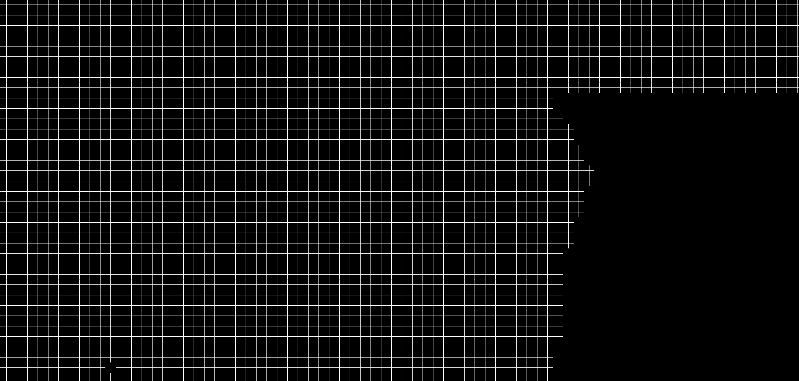

# Estruturação do Problema

## 1. Ambiente

Para representar o espaço onde os indivíduos transitam e interagem, será utilizado um **mapa quadriculado**, em que cada célula representa uma **casa** ou um **local de interesse**.  

Os locais de interesse são:  

- Escola (E)  
- Trabalho (T)  
- Supermercado (S)  
- Parque (P)  
- Festa (F)  

Cada agente possui uma **casa base (H)** de onde parte e para onde retorna no fim do dia.

Exemplo de representação:

Imagem real da cidade:  
  

Representação em quadrados:  
  

---

## 2. Agentes

Os agentes serão modelados como **autômatos probabilísticos**, cada um com os seguintes atributos:

- **Idade** (influencia rotina e suscetibilidade)  
- **Papel social** (estudante, trabalhador, desempregado, etc.)  
- **Estado de saúde**:  
  - Suscetível (S)  
  - Infectado (I)  
  - Recuperado (R)  

### Ciclo de Vida
- O tempo é dividido em **ticks** (ex.: 3 a 4 por dia).  
- Em cada tick, o agente decide uma ação, que pode ser **controlada** (rotina) ou **esporádica** (aleatória).  

#### Ações Controladas
- Escola / Trabalho → ocorrem em 1 ou 2 ticks fixos do dia.  
- Supermercado → ocorre de forma esporádica.  
- Festa → ocorre em horários sociais (noites e finais de semana).  

#### Ações em Caso de Doença
Se infectado, o comportamento pode mudar:  
- Faltar ao trabalho/escola.  
- Permanecer em casa (repouso).  
- Buscar atendimento médico (dependendo da gravidade dos sintomas).  

---

## 3. Fórmulas de Motivação para Ações

A **probabilidade de um agente realizar uma ação \(a\) em um tick \(t\)** é dada por:

\[
P_a(t) = B_a \cdot A(t) \cdot M_i
\]

Onde:  
- \( B_a \) → base da motivação da ação (constante, ex.: ir à escola = 0.9, ir à festa = 0.2).  
- \( A(t) \) → ajuste temporal (função que considera hora, dia da semana, fim de semana, feriado).  
- \( M_i \) → fator individual do agente (idade, papel social, sintomas).  

Exemplos:  
- Crianças → \( P_{escola}(t) \) alto em dias úteis pela manhã.  
- Adultos trabalhadores → \( P_{trabalho}(t) \) alto em dias úteis, baixo em fins de semana.  
- Todos → \( P_{supermercado}(t) \) moderado e aleatório.  
- Jovens → \( P_{festa}(t) \) alto em fins de semana.  

---

## 4. Fórmulas de Contaminação

A transmissão ocorre quando **um agente suscetível (S)** e **um agente infectado (I)** compartilham a mesma célula (local).  

A probabilidade de transmissão é definida por:

\[
P_{trans}(i,j) = \beta \cdot C_{loc} \cdot S_i \cdot I_j
\]

Onde:  
- \( \beta \) → taxa básica de transmissão da doença.  
- \( C_{loc} \) → fator de contágio do local (ex.: escola = alta densidade, festa = muito alta, supermercado = média, trabalho = variável).  
- \( S_i \) → suscetibilidade do agente \(i\) (idade, saúde, imunidade).  
- \( I_j \) → infectividade do agente \(j\) (depende do estágio da doença).  

### Progressão do Estado de Saúde
- \( S \to I \) com probabilidade \( P_{trans}(i,j) \).  
- \( I \to R \) com probabilidade \( P_{rec} \).  
- \( I \to D \) (morte) com probabilidade \( P_{mort} \).  

---

## 5. Objetivos da Simulação

- Observar o impacto do comportamento social na propagação da doença.    
- Medir:  
  - Número de infectados ao longo do tempo.  
  - Picos de contaminação.  
  - Tempo até estabilização (ou colapso das rotinas).  

---
